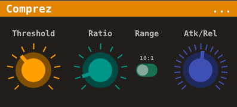

# Comprez

**Comprez is a simple but fast, versatile compressor plug-in.**

It's ready to give you a special compressor experience you may never have before. Although there are only 4 controllers currently, it does not limit your creation. 

Feel free to try out. You will meet your favorite compressor parameters, and enlighten your works!



## Features

- High performance
  - Only 0.1~0.2% CPU usage on Intel Core 2 Duo P9500
- Stereo input/output
- Wide threshold and ratio
- Switchable ratio range (`10:1` or `100:1`)
- Bundled Attack/Release time (set Attack/Release simultaneously)
  - DSP engine uses ramp generator to handle envelope, so you cannot set Attack or Release time separately.
  - But this is our feature! Voice and sound are compressed tenderly, beyond your imagination.
- Extra Lo-Fi FX support
  - By setting `Atk/Rel` to negative value, you will unlock Lo-Fi effect.
  - Sound stucks and distorts, just like playing music from your ancient tape recorder, covered with decades of thick dust.

## How To Build

### On Linux

#### Prerequisites

Comprez requires Python to generate plugin source code, and Python `virtualenv` for build environment.

Install them in your distro:

```bash 
# Arch Linux
sudo pacman -Syu python python-virtualenv

# Debian-based
sudo apt update
sudo apt install python
sudo python -m pip install virtualenv
```

#### Clone source

```bash
git clone https://github.com/AnClark/Comprez comprez --recursive
git submodule update --init --recursive
```

#### Build

```bash
cd comprez
make
```

Built plugin files resides in `build/bin`.

### On Windows

**Only Msys2 is supported officially.** It's up to you to test on Cygwin (or other environments).

(TO BE CONTINUED...)

## Credits

- **Author:** [AnClark Liu](https://github.com/AnClark)
- **DSP Engine:** [Heavy Stereo Compressor](https://github.com/Wasted-Audio/heavylib/blob/master/hv.compressor2~.pd) by Joe White
- **Credits to:** [Wasted Audio](https://github.com/Wasted-Audio/) Team, for their powerful [Heavylib](https://github.com/Wasted-Audio/heavylib) and [HVCC](https://github.com/Wasted-Audio/hvcc), and inspirations of Comprez

## License

Available under GNU GPLv3.

